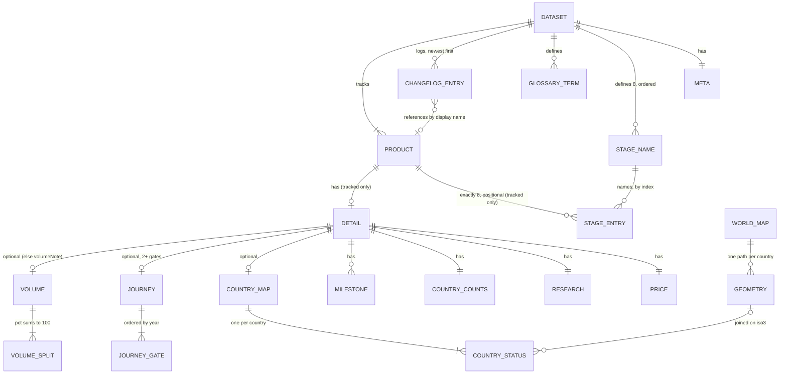
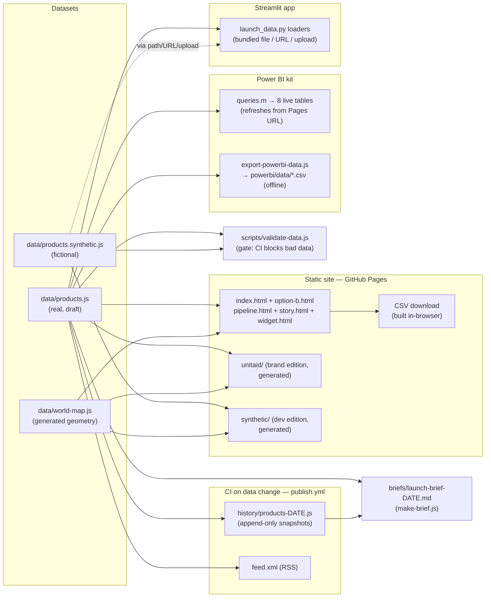

# LAUNCH Dashboard — Data Model & Lineage

*The one map of the data: what the entities are, how they relate, where every
downstream data product gets its rows, and how to extend any of it without
breaking the others.*

Read this alongside its siblings — they deliberately don't repeat each other:

| Doc | What it owns |
| --- | --- |
| **This document** | Entities, keys, relationships, lineage, extension playbooks. |
| [Data analyst guide](data-analyst-guide.md) §4 | Field-by-field dictionary: types, allowed values, editing rules. |
| [Developer guide](developer-guide.md) §11 | The schema-change checklist: every consumer to touch, in order. |
| [Domain primer](domain-primer.md) | What the data *means* — the pathway, the actors, the terminology. |

---

## 1. One contract, two datasets

Everything in the project reads a single **data contract**: a strict-JSON
object assigned to `window.LAUNCH_DATA`. Two files implement it:

| File | Contents | Served by |
| --- | --- | --- |
| [`data/products.js`](../data/products.js) | **Real data** (public-source draft, pending verification) | Root dashboards, `unitaid/` edition, Streamlit default, Power BI live queries |
| [`data/products.synthetic.js`](../data/products.synthetic.js) | **Fictional data** (invented companies and figures, every feature populated) | `synthetic/` edition; any tool via explicit path/URL |

Same schema, same governance rules, one validator:

```bash
node scripts/validate-data.js                              # real
node scripts/validate-data.js data/products.synthetic.js  # synthetic
```

Use the synthetic set to develop or demo features the real data can't feed yet
(volume splits, confirmed prices, a fully-scaled product, all six poster
phases). Never mix values between the two files.

A third data file, [`data/world-map.js`](../data/world-map.js)
(`window.LAUNCH_MAP`), is **generated geometry**, not analyst data — it joins
to the contract only on ISO-3166 alpha-3 codes (see §3).

## 2. Entity model

The contract is a document tree: one root object owning four top-level
collections, with all detail nested under `PRODUCT`. There are **no
cross-product references** — every product is self-contained, which is what
makes row-level edits safe.



Entity notes (types and editing rules live in the
[analyst guide's dictionary](data-analyst-guide.md#4-data-dictionary)):

| Entity | Where in JSON | Grain (one row =) | Identity |
| --- | --- | --- | --- |
| `META` | `meta` | the dataset | singleton |
| `STAGE_NAME` | `stages[]` | one pathway stage | **array index 0–7** (order is meaning) |
| `GLOSSARY_TERM` | `glossary{}` | one term | the term string (whole-word matched in UI) |
| `CHANGELOG_ENTRY` | `changelog[]` | one logged change | none (append-only list) |
| `PRODUCT` | `products[]` | one medicine / tool | `id` — permanent lowercase slug |
| `STAGE_ENTRY` | `products[].stages[]` | one product × one stage | **(product `id`, array index)** — position matches `stages[]` |
| `MILESTONE` | `detail.milestones[]` | one gate event for a product | (product `id`, row order) |
| `COUNTRY_STATUS` | `detail.countries.list[]` | one product × one country | (product `id`, `iso3`) — unique per product, highest `level` wins |
| `JOURNEY_GATE` | `detail.journey[]` | one dated gate | (product `id`, gate order) |
| `VOLUME_SPLIT` | `detail.volume.split[]` | one procurement channel share | (product `id`, `channel`) |

Two flavors of `PRODUCT` share the array:

- **Tracked** (`class: "pipeline" | "market"`) — full shape: 8 stage entries,
  `currentStage`, optional `flag`, full `detail`.
- **Placeholder** (`placeholder: true`) — identity + `note` only; renders as a
  greyed row and is excluded from every stat, export and chart.

## 3. Keys, references and their gotchas

- **`products[].id` is the primary key of everything.** It's the HTML anchor
  (`index.html#<id>`), the widget parameter (`widget.html?product=<id>`), and
  the `productId` foreign key in every flat export. It never changes, even
  when the display name does — ASPY's id is still `pyramax`. Renaming an id is
  a breaking change to external links and history diffs; don't.
- **Stage relationships are positional, not named.** `products[].stages[3]`
  *is* the product's status for `stages[3]` ("WHO prequalification"). The
  validator enforces the count (8); nothing can enforce that you didn't swap
  two entries — keep the order sacred when editing.
- **`changelog[].product` is a soft reference by display name** (or `"All"`),
  not by id. It survives product renames only if you keep old entries' wording
  (they're historical statements — never rewrite them). Filtering a product's
  history therefore matches on the *name it had at the time*.
- **`iso3` is the only cross-file join** in the system:
  `detail.countries.list[].iso3` → `LAUNCH_MAP.countries[ISO3]`. A status for
  a country missing from the 110m geometry simply doesn't render — check the
  key exists in `data/world-map.js` when adding small island states.
- **Story hero is a soft rule, not a key**: `story.html` looks for id
  `pyramax`, falling back to the first `class: "market"` product. Any dataset
  with at least one market product (the synthetic one qualifies) tells a story.
- **`currentStage` must agree with `stages[]`** (it's the index the UI
  highlights). The validator checks range, not consistency — when you advance
  a stage entry, move the marker in the same edit.

## 4. Derived values — computed, never stored

These numbers exist **only at render/export time**, so they can never disagree
with the underlying rows. Don't add stored copies of them.

| Derived value | Rule | Where computed |
| --- | --- | --- |
| Medicines tracked | count of non-placeholder products | all dashboards, Streamlit, DAX |
| Active bottlenecks | products with ≥ 1 `late` stage | same |
| "Expected to market ≤ 3 yrs" | products with `class: "pipeline"` | static pages |
| Journey segments (years between gates, pace class) | consecutive **integer-year** gates; gap ≤ 2 on-track / 3–5 slow / > 5 delayed; trailing "pending" segment to today when a `"TBC"` gate remains | `index.html` timing chart, `story.html`, `journeySegments.csv`, `queries.m`, `launch_data.journey_segments()` |
| Story numbers (waiting years, cure rate, counts) | derived from hero product's journey + portfolio | `story.html` |
| Brief movements | stage-status diff vs the closest `history/` snapshot before the window | `scripts/make-brief.js` |

If you change a derivation rule (e.g. the pace thresholds), change it in
**every** column of the "where computed" cell — they are parallel
implementations, listed in the developer guide's checklist.

## 5. Lineage — every data product and where it gets its rows



Rules the lineage encodes:

- **Upstream of this diagram sits `sourcing/`** — public-source raw snapshots
  and staging CSVs collected on a schedule (see the
  [data sourcing plan](data-sourcing-plan.md) and
  [`sourcing/README.md`](../sourcing/README.md)). It feeds *analyst
  decisions*, never the datasets directly: collected evidence enters
  `data/products.js` only through a normal analyst edit.
- **The validator is the only gate.** Every path starts at a dataset that
  passed it; no downstream product re-invents governance (they *display* it —
  see §7).
- **Generated outputs are committed but never hand-edited**: `unitaid/`,
  `synthetic/`, `powerbi/data/*.csv`, `history/`, `feed.xml`, `briefs/`,
  `data/world-map.js`. Each has exactly one generator script; regenerate,
  don't patch.
- **Only `data/products.js` triggers automation.** `publish.yml` is
  path-filtered to that one file — edits to the synthetic dataset deploy with
  the push but produce no history snapshot, no feed rebuild, no brief input.
- **The Power BI live path and CSV path must stay shape-identical** — the
  report is built once against either and refreshed against the live one.

## 6. The flat relational projection

Nested JSON flattens into the same eight tables everywhere — Power BI CSVs,
`queries.m` live tables, and Streamlit's row builders all produce this shape.
It's a simple star: `Products` is the hub; five detail tables carry
`productId` foreign keys; `Meta` and `Changelog` stand alone.

| Table | Grain | Key columns | Relationship |
| --- | --- | --- | --- |
| `Products` | one tracked product | `productId` | hub (1) |
| `Stages` | product × stage | `productId`, `stageIndex` | Products 1→* |
| `Milestones` | product × milestone | `productId` + row order | Products 1→* |
| `Countries` | product × country | `productId`, `iso3` | Products 1→* |
| `JourneyGates` | product × gate | `productId`, `gateIndex` | Products 1→* |
| `JourneySegments` | product × gap between dated gates | `productId`, `fromGate` | Products 1→* (derived — see §4) |
| `Meta` | the dataset | — | disconnected |
| `Changelog` | one change entry | — | disconnected (soft name link, §3) |

Conventions every flattener follows — keep them if you add one:

- Denormalize `productName` next to `productId` (display convenience).
- Statuses and levels ship with **label and rank** columns
  (`statusLabel`/`statusRank`: idle 0 → late 1 → prog 2 → done 3;
  `levelRank`: registered 1 → guidelines 2 → mft 3) so consumers sort and
  color without re-encoding semantics.
- Placeholder products are excluded from every table.
- `""` for absent strings, `"TBC"` passed through verbatim — never coerced to
  0 or null.

## 7. Governance semantics that must travel with the data

These fields are promises to readers. Any new data product must carry them
through, not strip them:

| Field | Promise | How existing products honor it |
| --- | --- | --- |
| `meta.dataStatus` | how much to trust the whole dataset | page banners; Streamlit banner; DAX `Data Status Banner` measure; brief header |
| `detail.countries.status` | map coverage is unverified unless `"verified"` | map warning overlay; DAX `Map Verification Warning`; `dataStatus` column in `Countries` table |
| `price.confirmedInWriting` / `source` | a shown price is releasable | validator error otherwise; column in `Products` table |
| `"TBC"` | honestly unknown — never estimated | rendered as-is everywhere; brief lists TBCs as the verification to-do |
| `late` + `note` + `flag` | a red light always has a written reason | tooltips, flag sentence, `Stages.note` |
| `meta.synthetic` | the whole dataset is fictional | synthetic edition strip; check this flag before treating any loaded dataset as real |

## 8. Extension playbooks

**Add a field to an existing entity** (e.g. a new detail card): follow the
[developer guide's schema-change checklist](developer-guide.md#schema-change-checklist)
top to bottom — data file(s), validator, static renderers + edition rebuilds,
Streamlit, Power BI (both paths), brief, analyst dictionary. Add the field to
**both datasets** (real value or `"TBC"` in the real file, a populated value
in the synthetic file so the feature is testable). Unknown fields are ignored
silently by every consumer, so nothing breaks while the rollout is partial —
but grep the field name across the repo before calling it done.

**Add a new entity under `detail`** (a new one-to-many, e.g. per-product
supply sites): model it as an array of flat objects with stable natural keys;
add validator rules (error = dashboard would lie, warning = provenance debt);
flatten it as a ninth table following §6's conventions (add to
`export-powerbi-data.js`, `queries.m`, `launch_data.py` in the same change);
decide its §7 row — what governance promise does it carry?

**Add a product**: copy the closest product block in the dataset, change
every field, keep exactly 8 stage entries, keep `currentStage` consistent,
validate, changelog it. New ids are forever — choose the slug carefully.

**Add or rename a pathway stage**: a structural change — `stages[]` plus a
matching positional entry in **every** product's `stages` array, then rebuild
the generated editions. All history snapshots before the change have the old
shape; `make-brief.js` diffs by index, so brief windows spanning the change
will misreport — cut a brief before, and note the discontinuity.

**Add a new downstream data product** (a new export, chart, or platform):
read from the contract (either dataset by URL/path), derive rather than store
(§4), reuse the flat projection if tabular (§6), carry the governance fields
(§7), and give it exactly one generator script if its output is committed
(§5). Then add it to the lineage diagram above and to the developer guide's
checklist so future schema changes reach it.

**Add a new dataset edition** (the synthetic pattern): create
`data/products.<name>.js` with `meta.synthetic` or a similar marker and
`dataStatus: "illustrative"`, validate it with the file argument, and generate
a page edition with a `scripts/build-<name>-edition.js` that rewrites the data
`<script src>` and adds an unmistakable visual marker. Never point the root
pages at it.
