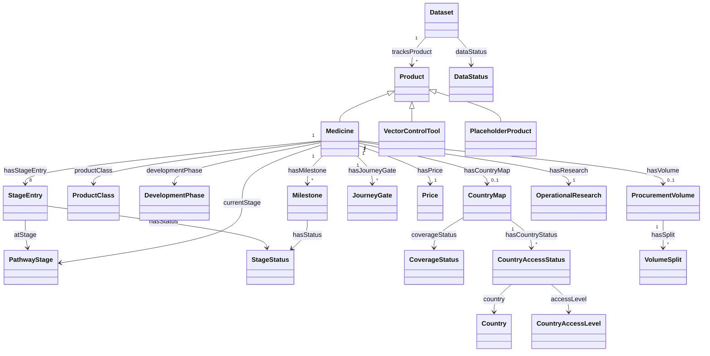

# LAUNCH Dashboard — Ontology & Linked Data

*The formal semantic layer: the data contract's entities, relationships and
controlled vocabularies expressed as an OWL/SKOS ontology, and the dataset
published as machine-readable linked data (JSON-LD).*

Read this alongside its siblings:

| Doc | What it owns |
| --- | --- |
| **This document** | The ontology: classes, vocabularies, external alignments, the linked-data export, and how to regenerate/extend them. |
| [Data model & lineage](data-model.md) | Entities, keys, relationships, lineage — the JSON-contract view of the same model. |
| [Domain primer](domain-primer.md) | What it all *means* — the pathway, the actors, the terminology. |
| [Data analyst guide](data-analyst-guide.md) §4 | Field-by-field dictionary of the JSON contract. |

---

## 1. What "the ontology" is, and why

The project already had a rigorous *implicit* ontology — the data model doc
defines entities, grains and keys; the domain primer defines the meaning of
every term; the validator enforces the semantics. This layer makes it
*explicit and machine-readable*:

- **Interoperability** — partners (WHO, RBM, funders) can consume the
  portfolio as standard linked data instead of reverse-engineering the JSON.
- **Precision** — "recommendation ≠ prequalification ≠ registration" is now a
  formal statement (three distinct pathway-stage concepts), not just prose a
  developer must remember.
- **Alignment** — products link to WHO ATC codes and schema.org types, so the
  dataset can be joined to external knowledge (drug databases, Wikidata,
  other health dashboards) without string matching.
- **Governance travels** — the provenance and trust semantics of
  [data-model.md §7](data-model.md#7-governance-semantics-that-must-travel-with-the-data)
  are first-class properties in the graph, not conventions lost in export.

## 2. The three files

| File | Role | Authored or generated |
| --- | --- | --- |
| [`ontology/launch.ttl`](../ontology/launch.ttl) | The ontology proper (OWL classes and properties, SKOS concept schemes and fixed concepts), in Turtle. | **Hand-authored** — the source of truth for the semantic layer. |
| [`ontology/context.jsonld`](../ontology/context.jsonld) | JSON-LD context mapping the contract's vocabulary to ontology IRIs. | **Hand-authored** — changes in lock-step with `launch.ttl`. |
| [`ontology/launch-data.jsonld`](../ontology/launch-data.jsonld) | The current dataset as linked-data instances (products, stage entries, country statuses, concepts, changelog). | **Generated** by `scripts/build-ontology.js` — regenerate, never hand-edit. |

All three are served by GitHub Pages, so every IRI under
`…/ontology/launch.ttl#` and `…/ontology/launch-data.jsonld#` dereferences to
the file that defines it — a working (if minimal) linked-data deployment with
no server-side requirements, in keeping with the rest of the site.

Regenerate after any change to `data/products.js`:

```bash
node scripts/build-ontology.js
```

(`node scripts/build-ontology.js <dataFile> <outFile>` projects another
contract dataset, e.g. the synthetic one, to a path of your choice — only the
real projection is committed.)

## 3. Class model

The ontology reifies the same grains as
[data-model.md §2](data-model.md#2-entity-model); where the JSON is positional
(a stage entry *is* index *i*), the graph is explicit (a `StageEntry` node
*points at* the stage concept).



`ChangelogEntry` nodes stand alone (soft display-name reference, exactly as
in the contract — see [data-model.md §3](data-model.md#3-keys-references-and-their-gotchas)).

## 4. Controlled vocabularies (SKOS)

Two kinds, deliberately split by where they can drift:

**Fixed in `launch.ttl`** (they are validator constants — change the
validator and the TTL together):

| Scheme | Concepts | Ordinal rank property |
| --- | --- | --- |
| `StageStatusScheme` | `idle` / `late` / `prog` / `done` | `statusRank` 0/1/2/3 (matches the flat projection) |
| `CountryAccessLevelScheme` | `registered` < `guidelines` < `mft` (also `skos:broader` chain) | `levelRank` 1/2/3 |
| `ProductClassScheme` | `pipeline` / `market` | — |
| `DevelopmentPhaseScheme` | `preclinical` → `phase1` → `phase2` → `phase3` → `regulatory` → `access` | — |
| `DataStatusScheme` | `illustrative` / `draft` / `live` | — |
| `CoverageStatusScheme` | `illustrative` / `draft` / `verified` | — |

**Generated from the data file into `launch-data.jsonld`** (so they can
never disagree with the contract):

| Scheme | Source in contract |
| --- | --- |
| `PathwayStageScheme` — the 8 stage concepts, `launch:stage-0` … `launch:stage-7`, each carrying its `stageIndex` | `stages[]` |
| `GlossaryScheme` — one concept per glossary term with `skos:definition` | `glossary{}` |

## 5. Contract-field → ontology mapping

| JSON contract | Ontology term | Notes |
| --- | --- | --- |
| dataset root | `launch:Dataset` | one node, `#dataset` |
| `meta.dataStatus` | `launch:dataStatus` → `DataStatusScheme` concept | |
| `meta.synthetic` | `launch:synthetic` (boolean) | |
| `products[]` (tracked) | `launch:Medicine` ⊑ `schema:Drug` | IRI `#product-<id>` |
| `products[]` (placeholder) | `launch:PlaceholderProduct` | identity + note only |
| `id` | `launch:productId` | the permanent slug; also the IRI fragment |
| `inn` | `launch:inn` ⊑ `schema:nonProprietaryName` | |
| `manufacturer` | `launch:manufacturerLabel` (literal) | deliberately *not* an organization entity — the contract stores a display string (see §8) |
| `class` / `phase` | `launch:productClass` / `launch:developmentPhase` → concepts | |
| `currentStage` | `launch:currentStage` → `launch:stage-<i>` | positional index made explicit |
| `flag` | `launch:bottleneckFlag` | the red-flag governance sentence |
| `stages[i]` | `launch:StageEntry` node `#product-<id>-stage-<i>` with `atStage` + `hasStatus` | reifies the positional relationship |
| `source` / `asOf` / `confirmedInWriting` | `launch:source` ⊑ `dcterms:source` / `launch:asOf` (xsd:date) / `launch:confirmedInWriting` | provenance triple carried wherever the contract carries it |
| `detail.price` | `launch:Price` node | |
| `detail.countries` | `launch:CountryMap` → `CountryAccessStatus` nodes → `schema:Country` nodes keyed by `iso3` | countries deduplicated across products |
| `detail.journey[]` | `launch:JourneyGate` (year kept verbatim — integer or `"TBC"`) | |
| `detail.volume` / `volumeNote` | `launch:ProcurementVolume` + `VolumeSplit` / `launch:volumeNote` | |
| `detail.milestones[]` | `launch:Milestone` | statuses reuse `StageStatusScheme` |
| `detail.research` | `launch:OperationalResearch` | |
| `changelog[]` | `launch:ChangelogEntry` (standalone, soft name link) | |

Conventions carried over from the flat projection
([data-model.md §6](data-model.md#6-the-flat-relational-projection)): `"TBC"`
passes through verbatim, never coerced; ranks accompany statuses/levels (on
the concepts, once, rather than denormalized per row). One deliberate
difference: empty-string fields are **omitted** in the graph rather than
emitted as `""` — absence of a triple is the correct linked-data encoding of
"no value".

## 6. External alignments

| External standard | How it's linked |
| --- | --- |
| **schema.org** | `Medicine` ⊑ `schema:Drug`; `schema:name`, `inn` ⊑ `schema:nonProprietaryName`; countries typed `schema:Country`; ATC codes as `schema:code` (`schema:MedicalCode`) |
| **WHO ATC** | ASPY → `P01BF06` (artesunate + pyronaridine), DHA–PPQ → `P01BF05` (artenimol + piperaquine), each with an `rdfs:seeAlso` to the BioPortal ATC PURL. GanLum and ALAQ have **no ATC code assigned yet** — add theirs to the `ATC` map in `scripts/build-ontology.js` when WHO assigns them. |
| **Wikidata** | `owl:sameAs` links (QIDs verified against wikidata.org, 2026-08-25): every country node (all 22, via the `WIKIDATA_COUNTRY` map — the generator warns when a new country lacks an entry), and the marketed combinations — ASPY → [Q39053484](https://www.wikidata.org/wiki/Q39053484) (artesunate/pyronaridine FDC), DHA–PPQ → [Q17048104](https://www.wikidata.org/wiki/Q17048104). Products link only where an item for the **actual combination** exists: `ganaplacide` (Q28209255) is the compound alone and `Eurartesim` (Q29005826) is one brand of DHA–PPQ, so neither qualifies. These links make the graph federatable with the largest open knowledge base. |
| **ISO 3166-1 alpha-3** | `launch:iso3` on every country node — the same join key the map geometry uses |
| **Dublin Core / SKOS / OWL** | provenance (`dcterms:source`), vocabularies (`skos:*`), the ontology itself |

### Discoverability: structured data in the dashboard page

`index.html` injects a schema.org JSON-LD block (`<script type="application/ld+json">`)
at render time — one `schema:Dataset` node plus one `schema:Drug` node per
tracked product, each carrying the **same `@id` as its canonical node in
`launch-data.jsonld`**, so page markup and linked-data export describe one
graph. Search engines and knowledge-graph crawlers discover the portfolio
directly from the live site. Derived at render time like every other
computed value (never stored), it is **skipped whenever `meta.synthetic` is
true**, so the synthetic edition can never index fictional medicines as real.
Option-A-only for now, matching the glossary/print precedent — the A/B winner
keeps it.

## 7. Governance semantics in the graph

Every promise in [data-model.md §7](data-model.md#7-governance-semantics-that-must-travel-with-the-data)
has a first-class representation — a consumer of the graph gets the trust
signals without reading any documentation:

| Promise | In the graph |
| --- | --- |
| dataset trust level | `#dataset launch:dataStatus launch:datastatus-draft` |
| map coverage unverified unless verified | `CountryMap launch:coverageStatus launch:coverage-illustrative` + `launch:note` |
| a shown price is releasable | `Price launch:confirmedInWriting` / `launch:source` |
| honestly unknown, never estimated | the literal `"TBC"`, verbatim |
| a red light has a written reason | `launch:status-late` entries carry `launch:note`; the product carries `launch:bottleneckFlag` (the concept's `skos:definition` states the rule) |
| the whole dataset may be fictional | `launch:synthetic true` on the dataset node |

## 8. Using it

Load `ontology/launch.ttl` + `ontology/launch-data.jsonld` into any RDF
store (Jena, RDFLib, Oxigraph, GraphDB…) and query. Example — *"which
products are delayed, at which gate, and why?"*:

```sparql
PREFIX launch: <https://kochrisdev.github.io/launch-transparency-dashboard/ontology/launch.ttl#>
SELECT ?product ?stage ?reason WHERE {
  ?p launch:hasStageEntry ?e ; schema:name ?product .
  ?e launch:hasStatus launch:status-late ;
     launch:atStage/skos:prefLabel ?stage ;
     launch:note ?reason .
}
```

Or in Python, no triple store needed:

```python
from rdflib import Graph
g = Graph()
g.parse("ontology/launch.ttl")
g.parse("ontology/launch-data.jsonld")
```

## 9. Maintenance and extension rules

- **Data changed?** CI regenerates automatically — `publish.yml` reruns
  `build-ontology.js` in the same bot commit as the history snapshot and feed
  rebuild whenever `data/products.js` changes on main. Rerun it manually only
  for local preview or after schema-layer edits. It is a downstream data product
  per the lineage in [data-model.md §5](data-model.md#5-lineage--every-data-product-and-where-it-gets-its-rows):
  reads the contract, derives rather than stores, carries the governance
  fields, one generator script.
- **Schema changed?** The
  [developer guide's schema-change checklist](developer-guide.md#schema-change-checklist)
  includes the ontology step: add the term to `launch.ttl`, map it in
  `context.jsonld`, emit it in `build-ontology.js`, then regenerate.
- **Validator enumeration changed** (a new status/level/phase)? Add the
  matching `skos:Concept` to `launch.ttl` in the same commit.
- **A new pathway stage** needs no ontology edit — stage concepts are
  generated from `stages[]` — but note the same history-discontinuity caveat
  as every other consumer.
- **Pages URL changed** (repo transfer)? Three places hold it: the `SITE`
  constant in `scripts/build-ontology.js`, the `launch:` prefix in
  `launch.ttl`, and the same prefix in `context.jsonld`. Old IRIs are
  breaking-change territory, same as renaming a product id.
- **A new country in any product's list?** Add its QID to `WIKIDATA_COUNTRY`
  in `scripts/build-ontology.js` (the generator warns if you forget — look up
  the code via Wikidata property P298).
- **Future normalization candidates** (deliberately out of scope, because the
  contract stores display strings): organization entities for
  manufacturers/PDPs/funders (`manufacturerLabel` → `schema:manufacturer` →
  `schema:Organization` nodes, which would also give Wikidata org links a
  home), typed dates for the free-form date labels, and SHACL shapes encoding
  the governance rules for RDF-side validation. Add the normalizations only
  when/if the contract itself normalizes the underlying fields.
