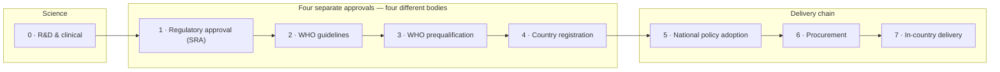
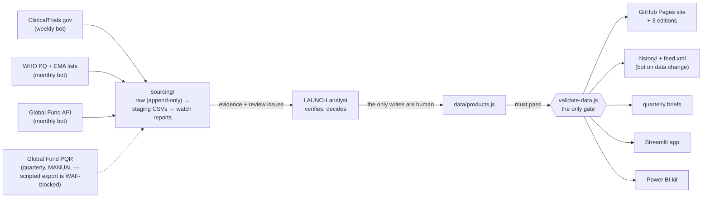

# Inside the LAUNCH Dashboard — the whole project, explained

A complete plain-language guide to the LAUNCH Transparency Dashboard — what problem
it solves, the world it describes, how to read it, where its numbers come from, and
how it is built. Written for **all stakeholders, expert and non-expert**. Each part
goes one level deeper; read to your depth and stop when you have what you need.

| Part | For | Question it answers |
| --- | --- | --- |
| [1 · Why this exists](#part-1--why-this-exists) | Everyone | What problem does this solve? |
| [2 · The medicine's journey](#part-2--the-medicines-journey) | Everyone | What world does the dashboard describe? |
| [3 · Reading the dashboard](#part-3--reading-the-dashboard) | Users | How do I use it, and how much can I trust each number? |
| [4 · Where the numbers come from](#part-4--where-the-numbers-come-from) | Analysts | How does evidence become a dashboard value? |
| [5 · How it is built](#part-5--how-it-is-built) | Developers | What is the architecture and automation? |
| [6 · Glossary](#part-6--glossary) | Reference | What does that term mean? |
| [7 · Status & open items](#part-7--current-status--open-items) | Everyone | How finished is this? |

> Where this document and `data/products.js` disagree, the data file wins.
> A designed, shareable web version of this guide exists as a Claude artifact
> (ask the LAUNCH team for the link).

---

## Part 1 · Why this exists

**In one sentence:** new malaria medicines take 10–15 years to travel from
"approved" to actually reaching patients, largely because no one can see where each
medicine is stuck — so LAUNCH built a public dashboard that shows every medicine,
every gate it must pass, and every bottleneck, with a dated reason on each delay.

### The problem: approval is not access

Malaria still kills on the order of half a million people a year, and progress has
stalled since 2015. New medicines exist, or are close — yet historically it has
taken **10 to 15 years or more** for a malaria product to move from regulatory
approval to routine use in the countries that need it. One worked example from this
project's own documentation: pyrethroid-PBO bednets took **eight years** just to
move from an interim to a full WHO recommendation — eight years inside a single
gate, after the science was settled.

The clock now matters more than ever. **Artemisinin partial resistance** — malaria
parasites responding more slowly to the core drug class behind nearly all modern
treatment — has emerged in Southeast Asia and is confirmed in parts of East Africa.
Medicines that work against resistant parasites are in the pipeline, but a
decade-long adoption lag could arrive too late.

### The diagnosis: a coordination failure

The delay is largely a *visibility* problem, not a science problem. A medicine's
journey runs through many independent institutions — WHO, regulators, funders,
manufacturers, health ministries — each waiting on signals from the others. Nobody
can see the whole board, so delays are discovered years after they begin.

**LAUNCH** (the Launch Transparency Initiative for new malaria tools, funded by
Unitaid) is a bet that making the whole board visible changes behavior: if every
actor can see every product, every gate, and every bottleneck — with a dated,
written reason on each delay — partners can act on delays instead of discovering
them later. The dashboard is that board. It will be hosted by the **RBM Partnership
to End Malaria**, with technical oversight from the LAUNCH AMDR Core Advisory Group.

### Three ideas that carry everything else

1. **"Approved" is not one fact — it is at least three.** WHO *recommends* a
   medicine, WHO separately *prequalifies* its quality, and each country
   *registers* it — three independent decisions by three different bodies on three
   different calendars. Then a ministry must write it into national guidelines, a
   funder must buy it, and a supply chain must deliver it. Any gate can stall for
   years while all the others show green.
2. **The dashboard is read by the institutions it measures.** WHO committees,
   funders, and manufacturers all see their own gates on the board. Every
   governance decision follows from that: a red light is an accusation in this
   domain, so the system makes an unsubstantiated accusation structurally
   impossible.
3. **Credibility comes from refusing to guess.** Where a figure is unverified, the
   dashboard shows `TBC` ("to be confirmed") rather than an estimate. Every
   displayed number carries its public source and the date it was last verified.
   One invented number, discovered by the institutions being measured, would end
   the dashboard's credibility; an honest gap does not.

---

## Part 2 · The medicine's journey

**In one sentence:** every medicine on the board travels the same eight-stage
pathway — one science stage, four separate approvals run by four different bodies,
and a three-stage delivery chain — and the dashboard tracks which gate each
medicine is at and where it is stuck.

The highlighted middle gates (1–4) are four **independent** approvals by four
different institutions — the single most misunderstood fact in this domain. A
product can pass all of them and still reach no one if a ministry never adopts it
(stage 5) or no funder buys it (stage 6).

### The eight stages, in plain words

| # | Stage | What it means | Who runs it |
| --- | --- | --- | --- |
| 0 | R&D & clinical | Laboratory development and human trials (Phase I safety → II dosing → III large multi-country efficacy trials, typically 3–6 years). | Manufacturer + product development partnerships |
| 1 | Regulatory approval (SRA) | Review by a stringent regulator such as the EMA or US FDA. Malaria products usually use the EMA's **EU-M4all** procedure (formerly "Article 58") — a full EMA scientific review for medicines used outside the EU. This opinion anchors everything downstream. | EMA / FDA |
| 2 | WHO guidelines | WHO's expert group (the Guidelines Development Group) weighs the evidence and decides whether WHO *recommends* the medicine. Countries largely copy these. | WHO Global Malaria Programme |
| 3 | WHO prequalification | WHO's *quality* check — dossier review plus factory inspections — that makes a product eligible for purchase by UN agencies and major donors. The ticket that lets the Global Fund buy it. | WHO Prequalification Team |
| 4 | Country registration | Each country's own regulator licenses the product nationally — often sequentially, country by country. The African Medicines Agency and WHO's collaborative registration procedure exist to speed this up. | National regulatory authorities |
| 5 | National policy adoption | The ministry of health writes the medicine into *national treatment guidelines* — the document that determines what health workers actually prescribe. A WHO recommendation does **not** flow into these automatically. | Ministries of health / NMCPs |
| 6 | Procurement | Someone actually pays: Global Fund grants (the majority of treatment volume), US PMI, UNICEF, domestic budgets. Tenders, reference pricing, forecasting. | Global Fund, PMI, governments |
| 7 | In-country delivery | The last mile: supply chain to clinics, health-worker training, job aids, safety monitoring (pharmacovigilance). | Governments + implementing partners |

### The traffic lights

| Light | Meaning |
| --- | --- |
| 🟢 ✓ Complete | This gate has been passed (with a cited source). |
| 🟡 › In progress | Actively moving at a normal pace. |
| 🔴 ! Delayed | Stuck or slipped — a one-sentence, dated reason under the row says why. A red light can **never** appear without a written reason; the data validator makes that structurally impossible. |
| ⚪ Not started | Not yet reached (dashed outline). |

A halo ring marks the medicine's **current position**. Elapsed time between gates
is colored on one scale everywhere: **green ≤ 2 years, amber 3–5, red over 5**.

### The medicines tracked

LAUNCH deliberately picked **two pairs that stress opposite halves of the
pathway** — on the board, the pipeline products light up red on the left half, the
marketed products on the right half.

| Product | What it is | Where it stands |
| --- | --- | --- |
| **GanLum** (ganaplacide–lumefantrine, KLU156) — Novartis + MMV | The first non-artemisinin novel-class combination in ~25 years; works against artemisinin-resistant parasites. | Phase III (KALUMA) met its endpoint Nov 2025 with a 97.4% cure rate. The watch: how fast SRA → guidelines → PQ goes. |
| **ALAQ** (artemether–lumefantrine–amodiaquine) — Fosun Pharma + MORU | A triple ACT: a second partner drug added to the standard treatment to protect it from resistance (DeTACT partnership). | Targeting approval / PQ ~2027. |
| **ASPY / Pyramax** (pyronaridine–artesunate) — Shin Poong + MMV | An approved ACT, underused. | EMA opinion 2012, PQ'd, WHO-recommended 2022, registered in 25+ countries — yet in only a handful of national guidelines. **Bottleneck: policy adoption (stage 5).** |
| **DHA–PPQ** (dihydroartemisinin–piperaquine) — Alfasigma, Guilin & others | An approved ACT with multiple PQ'd suppliers (supply security). | Approved 2011, recommended 2015 — yet a small share of global procurement. **Bottleneck: procurement (stage 6).** |
| **Spatial emanators** — SC Johnson | Airborne mosquito-repellent devices (prevention). | Placeholder row pending funder approval (Gates Foundation). Prevention products travel a *different* WHO track (PQ Vector Control), so treatment stage names won't literally apply. |

### Who's who

**The WHO wears three separate hats** — recommender (Guidelines Development Group,
stage 2), quality assessor (Prequalification Team, stage 3), and coordinator.
Never conflate them. The other actors:

- **EMA / FDA** — stringent regulators; "SRA approval" here almost always means the EMA's EU-M4all opinion.
- **National regulators** — one per country (stage 4); AMA and WHO's ~90-working-day collaborative registration procedure accelerate them.
- **Ministries of health / NMCPs** — own national treatment guidelines (stage 5).
- **Global Fund, US PMI, UNICEF, domestic budgets** — the buyers (stage 6); the Global Fund's public PQR database is the record of prices and volumes.
- **Product development partnerships** — MMV (GanLum, ASPY), MORU/DeTACT (ALAQ), DNDi.
- **Manufacturers** — Novartis, Fosun Pharma, Shin Poong, Alfasigma/Guilin, SC Johnson.
- **Unitaid** funds LAUNCH; **RBM Partnership to End Malaria** will host the dashboard; the **LAUNCH team** supplies the analyst judgement behind each current position and bottleneck sentence.

---

## Part 3 · Reading the dashboard

**In one sentence:** one row is one medicine's whole life story left-to-right; the
red sentence under a row is the single most important thing on the page; and three
trust signals — the banner, `TBC`, and the source lines — tell you exactly how much
to believe every number.

### The views

| View | Page | What it's for |
| --- | --- | --- |
| Journey board | `index.html` | **Design Option A (default).** One row per medicine, its full pathway left to right. Country map, timing chart, CSV download, glossary tooltips, print view, Recent updates. |
| Comparison matrix | `option-b.html` | **Design Option B.** Stages as rows, medicines as columns — cross-product comparison at each gate. Same data, distinct identity. |
| Pipeline poster | `pipeline.html` | The portfolio laid out MMV-poster style by development phase, with a prevention lane. Complementary — not part of the A/B decision. |
| Data story | `story.html` | "The Waiting Years" — a scroll-driven narrative for donors and advocacy. Every number is computed live from the data, so the story updates itself. |
| Widget | `widget.html` | Embeddable one-row tracker for partner sites (`?product=aspy` etc.). |

Three parallel **editions** of all views also exist: `unitaid/` (brand review),
`synthetic/` (fictional data for safe development, purple warning strip), and `v2/`
(proposed data updates awaiting sign-off, then retired).

### How to read a row

- **Start with the red sentence** — it names the bottleneck LAUNCH is tracking, with a date. It is the initiative's core editorial output.
- **The halo ring** marks where the product is right now.
- **Hover any stage dot** for status detail, the next expected step, and the verification date.
- **Click a row** for the full profile: use case, price, access commitments, adoption requirements, country access, operational research, procured volumes, time-between-gates, and the milestone table (the accountability ledger — every row carries its own source).
- **Returning visitors:** start at *Recent updates*; an RSS feed (`feed.xml`) carries every change.

### The three trust signals

1. **The banner under the title.** *Design mockup* = placeholder data. *Draft data* = compiled from public sources, pending verification. *No banner* = verified, live. (Currently: draft.)
2. **`TBC`** — no verifiable figure yet. The dashboard never estimates.
3. **Provenance lines under figures** — public source, written manufacturer confirmation, date last verified.

Two rules worth knowing the reasoning behind:

- **The price rule.** A price appears only when public or confirmed in writing by the manufacturer; manufacturers run tiered, confidential pricing, and publishing an unconfirmed number could damage the relationships LAUNCH needs.
- **The map rule.** The country map carries an *ILLUSTRATIVE* warning and must not be cited until the country survey is verified — a colored country reads as a fact in a way a `TBC` count never does.

### Who uses it, and how

| Audience | Typical use |
| --- | --- |
| Donors & funders | Which products are stuck at procurement; volumes by channel; CSV export. |
| Ministries of health | Country access status, adoption requirements, peer-country status on the map. |
| Implementing partners | Operational research and the delivery stage. |
| Manufacturers | Their product's position; confirm or correct the price field. |
| Republishers | Everything shown is public — export CSV and cite; or embed the per-medicine widget. |

**Cadence:** milestones monthly (and within days of major events); procurement and
country data quarterly. Errors → LAUNCH team (via RBM once hosted) or a GitHub
issue; corrections are logged in Recent updates.

---

## Part 4 · Where the numbers come from

**In one sentence:** robots collect evidence from public sources into a staging
area, a human analyst decides what becomes dashboard data, and an automated
validator — the only gate — makes it structurally impossible for the board to show
an unsourced price, an unexplained delay, or a silently lying traffic light.

Bots collect and propose. Humans decide. The validator guards. Everything
downstream just displays.

### One file, one gate

All routine updates change exactly one file: `data/products.js` — every product,
stage status, milestone, price and country status, plus a glossary and changelog.
Before any change ships, `scripts/validate-data.js` checks it against the
governance rules; its stated purpose: *"a traffic light must never be able to lie
silently."*

### Every value carries its provenance

- `source` — a public, citable origin (WHO PQ list, EMA register, press release).
- `asOf` — the date the value was last verified.
- `confirmedInWriting` — the manufacturer confirmed release in writing. The register of confirmations lives **outside the public repo** by policy.
- `TBC` — honestly unknown. Never estimated.

### The governance rules the validator enforces

| Rule | Plain meaning |
| --- | --- |
| Red needs a reason | A delayed stage must carry a substantive written note **and** the product a top-level bottleneck sentence. |
| Prices are earned | A displayed price requires written confirmation **or** a public source; otherwise `TBC`. |
| No invented counts | Country counts are real non-negative integers or `TBC` — "an invented number is worse than an admitted gap." |
| Volumes must add up | Channel splits sum to 100%; a missing volume needs a written explanation. |
| Structure is sacred | Exactly 8 stage entries per product, valid statuses and dates, unique permanent IDs, chronological journey gates, one map entry per country. |
| Definitions are real | Glossary definitions are actual sentences; completed milestones should cite a source. |

Summary stats (medicines tracked, active bottlenecks) are **computed from the data
at render time** — they can never disagree with the board.

### The analyst loop

1. Edit `data/products.js`.
2. Run `node scripts/validate-data.js` — not optional.
3. Add a changelog entry; bump `meta.lastUpdated`.
4. Commit and push — live in ~2 minutes.
5. Automation does the rest: a dated snapshot lands in `history/`, and `feed.xml` is rebuilt.

A quarterly script (`scripts/make-brief.js`) generates a **"what changed" brief** —
stage movements vs history, logged updates, bottlenecks, and every remaining `TBC`
as the verification to-do list. A GitHub issue opens on the 1st of each month with
the milestone-scan checklist.

### The sourcing layer

| Collector | Source & cadence | Feeds |
| --- | --- | --- |
| `scripts/fetch-trials.js` | ClinicalTrials.gov API v2 — weekly, automated; diffs status/phase/date/results changes (slipped dates are early bottleneck warnings). | Stage 0, operational research, milestones |
| `scripts/fetch-regulatory.js` | WHO PQ lists (medicines + vector control) and EMA EU-M4all opinions — monthly, automated; watches listings/delistings/opinion changes. | Stages 1, 3, 4 |
| `scripts/fetch-globalfund.js` | Global Fund Data Service API (grants + disbursements) — monthly, automated. | Funding context, stage 6 |
| `scripts/normalize-pqr.js` | Global Fund PQR price/volume crosstab — quarterly, **manual download** (scripted export is confirmed WAF-blocked), then normalized by script. | Prices & volumes, stage 6 |

Three rules keep this layer honest: raw snapshots are dated and append-only;
staging files are regenerated by script, never hand-edited; every staging row
carries its source URL and retrieval date. And the cardinal rule: **nothing in
`sourcing/` feeds the dashboards directly** — an analyst's sourced edit, checked by
the validator, is the only path in.

### Source hierarchy

When sources disagree, prefer in order: WHO lists and guidelines → stringent
regulators (EMA, FDA) → procurement databases (Global Fund PQR, PMI reports) →
national regulators and ministries → manufacturer announcements (fine for
milestones, never sufficient alone for prices) → LAUNCH's own surveys, labelled
draft until verified.

---

## Part 5 · How it is built

**In one sentence:** a deliberately static, zero-build, zero-backend site — plain
HTML pages rendering one strict-JSON data file with vanilla JavaScript, deployed by
GitHub Pages on every push, with all automation living in four GitHub Actions
workflows.

### Why so deliberately simple

The dataset is tiny, the maintainers are analysts rather than developers, and the
18-month initiative will be handed over — so there must be nothing to install,
upgrade, or break. No framework, no bundler, no root package.json. The repo root
*is* the website.

The data contract is a JS file assigning strict JSON to `window.LAUNCH_DATA` —
deliberately a script, not fetched JSON, so `index.html` works when double-clicked
from the file system (no server, no CORS). The body must stay strict JSON because
the validator and every other consumer extract and parse it with the same idiom.

### How a page renders

Each page is self-contained: design tokens in a `<style>` block, an HTML skeleton,
one render script that derives the summary stats from the data (so they can never
disagree with the board), draws the stage tracks, wires tooltips and keyboard
access, paints the country map from generated Natural Earth geometry
(`data/world-map.js`), and positions the timing chart with percent-positioned
elements — no chart library. Every interpolated value passes through `esc()`;
status is always shape + color; light and dark themes are token-level.

### Generated editions — regenerate, don't hand-edit

Three builders write themed or re-datasourced copies into committed folders:
`unitaid/` (brand-token override appended as the last stylesheet),
`synthetic/` (fictional dataset + purple warning strip), and `v2/` (proposal
dataset + preview strip; deleted after sign-off). The iron rule for all committed
build output — editions, map geometry, history, feeds, briefs, CSV exports:
**rerun the builder, never edit the output.**

### The four CI workflows

| Workflow | Trigger | What it does |
| --- | --- | --- |
| `validate.yml` | Every push and PR | Validates all three datasets and builds the single-file preview as a smoke test. The quality gate. |
| `publish.yml` | Push to main touching `data/products.js` only | Validates, appends a dated `history/` snapshot (append-only — refuses to overwrite same-day with different content), rebuilds `feed.xml`, bot-commits. Its own commit can't retrigger it. |
| `reminder.yml` | 1st of each month | Opens the milestone-scan checklist issue. Deliberately a reminder, not a scraper — most watched sources are CMS pages where hash-watching would cry wolf. |
| `sourcing.yml` | Mondays (trials); 3rd of month (Global Fund + regulatory); on demand | Runs the fetchers, commits only under `sourcing/` (ignored by `publish.yml`'s path filter, so a fetch can never trigger a dashboard change), opens watch issues on changes. |

GitHub Pages deploys the repo root on every push to main — live in 1–2 minutes.
CI does **not** gate the deploy: a red validation run is a fix-now / revert-now
signal.

### The parallel platforms

- **Streamlit app** (`streamlit-app/`) — a Python twin of all views, used as the analyst workbench: accepts the bundled file, a URL, or a dragged-in draft, and shows live governance-check results — preview and validate a data update *before* committing. Adds runtime configuration the static site can't: product filters, adjustable timing thresholds, a hide-unverified-map toggle.
- **Power BI kit** (`powerbi/`) — a kit, not a binary: Power Query scripts loading eight relational tables live from the published site, offline CSVs of the same shape, a theme, DAX measures (the data-status banner and unverified-map warning travel into Power BI too), and a page-by-page build guide.

### Handover

Three options for RBM, all cheap because the site is static files: copy the file
set to any path on their site; keep the Pages deployment (or a fork under an RBM
org) and embed via iframe; or transfer the repository — history and CI move, only
the URL changes (update the `SITE` constant in `scripts/make-feed.js`, `DataUrl`
in `powerbi/queries.m`, and partner embed snippets).

---

## Part 6 · Glossary

| Term | Plain meaning |
| --- | --- |
| ACT | Artemisinin-based combination therapy — fast-acting artemisinin + a longer-acting partner drug; the global standard treatment. One product (artemether–lumefantrine) is ~70%+ of the market; everything here diversifies away from that monoculture. |
| TACT / triple ACT | An ACT with a second partner drug added to protect it from resistance (ALAQ). |
| Artemisinin partial resistance | Parasites cleared more slowly by the core drug class — not full treatment failure yet in Africa, but the urgency driver. |
| SRA | Stringent regulatory authority — an advanced regulator such as the EMA or US FDA. |
| EU-M4all / Article 58 | The EMA procedure giving a full scientific review to medicines used outside the EU — the usual first approval for malaria medicines. |
| Prequalification (PQ) | WHO's quality/manufacturing assessment (dossier + inspections) that makes a product eligible for UN and donor purchase. Quality, not efficacy. |
| EOI | Expression of Interest — the WHO list a product must be invited onto before PQ. |
| GDG | Guidelines Development Group — WHO's expert committee deciding recommendations, on its own calendar (a classic delay hotspot). |
| NMCP | National malaria control programme. |
| MFT | Multiple first-line therapies — deploying 2–3 first-line treatments at once to spread drug pressure; the main use case for new products. |
| PDP | Product development partnership (MMV, DNDi, MORU/DeTACT). |
| PQR | The Global Fund's public price & volume database. |
| CRP / AMA | WHO's collaborative registration procedure (~90 working days) and the African Medicines Agency — the stage-4 accelerators. |
| Pharmacovigilance | Ongoing monitoring of a medicine's real-world safety — a standard adoption requirement. |
| Operational research | Real-world implementation studies — distinct from clinical trials. |
| "Treatment" as a unit | One full course for one patient — volumes count courses, not tablets or packs. |
| TBC | To be confirmed — no verifiable figure yet; the dashboard never estimates. |
| Bottleneck flag | The one-sentence, dated reason a product is stuck — structurally required wherever a red light appears. |

---

## Part 7 · Current status & open items

- **The data is in draft** — compiled from public sources, pending LAUNCH verification and written manufacturer confirmations. Every page says so in its banner.
- **Two page designs are live in parallel** (journey board vs comparison matrix) awaiting a client decision.
- **The country map shows an ILLUSTRATIVE warning** until the country survey is verified.
- **The timing thresholds** (≤2 / 3–5 / >5 years) are acknowledged draft placeholders pending LAUNCH's benchmark work.
- **A v2 data preview awaits sign-off** — the first harvest of collected public-source data, kept separate at `/v2/` until approved.
- **Hosting, branding, and analytics** are pending external parties (RBM web team, RBM brand guidelines, analytics choice).
- **The spatial-emanators row awaits funder approval** — activating it forces the prevention-specific stage-names decision.

---

*Synthesized from the project's own documentation ([user guide](user-guide.md),
[domain primer](domain-primer.md), [data-analyst guide](data-analyst-guide.md),
[data model & lineage](data-model.md), [data sourcing plan](data-sourcing-plan.md),
[developer guide](developer-guide.md), [checklist](checklist.md)). Compiled
2026-08-23; data status at compile time: draft.*
